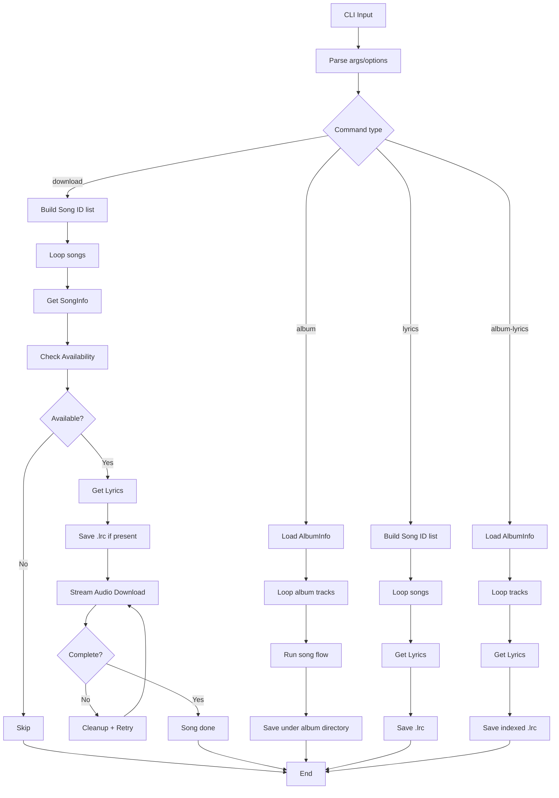

# Full Software Specification: NetEase Music Downloader

## 1. System Purpose
This software is a command-line application that can:
1. download one or more songs from NetEase Cloud Music;
2. download all tracks in an album;
3. download lyrics only (`.lrc`) for songs or albums.

The system goal is to reliably produce local media/lyrics files, even in unstable network conditions, by combining direct access, proxy fallback, retries, and defensive file handling.

Current package version: `0.10.0`.

## 2. Functional Scope
The specification covers only local runtime behavior:
- CLI input parsing;
- HTTP interaction with NetEase endpoints;
- proxy policy (manual and automatic fallback);
- streaming file download;
- local filesystem output;
- operational console logging.

It excludes CI/CD workflows and external automation pipelines.

## 3. Domain Model
### 3.1 Song
- `id`: numeric song identifier as string.
- `name`: normalized title (can include alias).
- `artists`: list of artist names.
- `album`: album metadata (name, optional cover URL).
- `duration`, `publish_time`: optional metadata.

### 3.2 AlbumInfo
- `album_name`
- `artist_name` (aggregated)
- `songs` (ordered track list)
- optional metadata (`pic_url`, `publish_time`)

### 3.3 Availability
- `available`: whether a playable downloadable URL is found.
- `url`: resolved media URL.
- `quality`: selected quality tier.
- `bitrate`: estimated bitrate.
- `file_type`: inferred extension from final URL.
- `content_length`: content length from HEAD metadata.
- `need_proxy`: whether the selected path requires proxy usage.

## 4. CLI Contract
Global options:
1. `--proxy <url>`: use a fixed proxy.
2. `--auto-proxy`: enable automatic proxy fallback.

Commands:
1. `download [ids...] [-f file] [--program|-P]`
- Download songs (audio + lyrics when present).
- Supports `--program` mode to treat input IDs as program IDs and resolve them to `mainSong`.

2. `album <albumId|url>`
- Download all album tracks (audio + lyrics when present).

3. `lyrics [ids...] [-f file] [--program|-P]`
- Download lyrics only for song IDs.
- Supports `--program` mode to treat input IDs as program IDs and resolve them to `mainSong`.

4. `album-lyrics <albumId|url>`
- Download lyrics only for all album tracks.

Input rules:
1. IDs may be raw numeric values or extracted from URLs containing `id=`.
2. File input supports one ID per line.
3. Empty lines and comment lines (`#`) are ignored.
4. IDs are deduplicated before execution.
5. In `download --program` or `lyrics --program`, each ID is interpreted as a DJ program ID.
6. `-P` is a short alias for `--program` in both `download` and `lyrics`.

## 5. Logical Architecture
The system is split into six cooperating components.

### 5.1 CLI Orchestrator
Responsibilities:
- parse command/options;
- merge IDs from CLI + file sources;
- dispatch to use-case handlers;
- isolate per-item errors to keep batch execution alive.

### 5.2 NetEase API Service
Responsibilities:
- build encrypted API payloads;
- perform HTTP requests to NetEase eapi endpoints;
- map JSON responses into domain types;
- resolve playable media URL by quality tiers;
- retrieve lyrics.

### 5.3 Proxy Service
Responsibilities:
- collect candidate proxies from multiple public providers;
- cache candidates with TTL;
- validate candidates with short health checks;
- return the first usable proxy.

### 5.4 Download Use Cases
Responsibilities:
- execute command-specific flow (`download`, `album`, `lyrics`, `album-lyrics`);
- enforce retries/timeouts;
- stream data to files;
- perform cleanup on failure;
- report progress and summary.

### 5.5 Filesystem Utilities
Responsibilities:
- sanitize file names;
- ensure required directory structure;
- construct deterministic output paths.

### 5.6 Domain Types
Responsibilities:
- define stable transfer structures shared across modules.

## 6. NetEase eapi Protocol and Encryption
All protected API calls use `eapi`.

Algorithm:
1. serialize JSON payload to `text`;
2. build `message = "nobody{path}use{text}md5forencrypt"`;
3. compute hexadecimal MD5 digest from `message`;
4. build `data = "{path}-36cd479b6b5-{text}-36cd479b6b5-{digest}"`;
5. encrypt `data` with AES-128-ECB and PKCS padding using fixed eapi key;
6. convert encrypted bytes to uppercase hex;
7. submit as `params=<HEX>` via `application/x-www-form-urlencoded` POST.

Logical endpoint groups:
1. song detail;
2. album detail;
3. player URL by quality;
4. lyrics;
5. DJ program detail (to resolve program ID to song ID).

## 7. Availability and Quality Selection Algorithm
Input: `song_id`.

Procedure:
1. iterate quality tiers in descending order:
- `hires`, `lossless`, `exhigh`, `higher`, `standard`.
2. request media URL for current tier;
3. if missing, continue to next tier;
4. issue `HEAD` request for candidate URL;
5. validate HTTP status (success or valid redirect);
6. read `content-length`;
7. reject candidates below minimum threshold (500 KB);
8. infer file extension from final URL path;
9. return first valid candidate as `Availability`.

If no tier yields a valid candidate, song is treated as unavailable.

## 8. Network and Proxy Strategy
Connection policy:
1. always try direct connection first;
2. if direct path fails and `--auto-proxy` is enabled:
- obtain a working proxy from proxy manager;
- retry availability/download through proxy;
3. if auto mode is off but a manual proxy is configured:
- retry using manual proxy.

Proxy manager policy:
1. maintain in-memory candidate cache with 10-minute TTL;
2. refresh cache when expired or explicitly forced;
3. normalize candidate shape (`host`, `port`, `protocol`);
4. test candidates with short timeout;
5. return the first candidate that passes health checks.

## 9. Command Execution Flows
### 9.1 `download`
For each song ID:
1. normalize/resolve ID;
2. if `--program` is enabled, resolve `program.mainSong.id`;
3. fetch song metadata;
4. run availability check with connection policy;
5. if unavailable: log and skip;
6. fetch lyrics and save `.lrc` when present;
7. build output name `<artist>-<title>.<ext>`;
8. if target file already exists: skip;
9. stream media with progress reporting;
10. validate completion;
11. on failure: delete partial file and retry up to limit.

### 9.2 `album`
1. resolve album ID;
2. fetch album metadata and track list;
3. create album directory `downloads/<artist>-<album>/`;
4. process tracks sequentially in source order;
5. apply single-song logic to each track;
6. naming convention:
- audio: `NN.<artist>-<title>.<ext>`;
- lyrics: `NN.<artist>-<title>.lrc`;
7. produce summary counters (`success`, `skipped`, `failed`).

### 9.3 `lyrics`
1. resolve song IDs;
2. if `--program` is enabled, resolve `program.mainSong.id`;
3. for each song: fetch metadata and lyrics;
4. save `.lrc` in base output directory when available;
5. report missing lyrics without failing full batch.

### 9.4 `album-lyrics`
1. fetch album track list;
2. request lyrics per track;
3. save indexed `.lrc` files inside album directory.

## 10. Filesystem Rules
Base output directory:
- `./downloads/`

Naming rules:
1. remove invalid characters (`<>:"/\\|?*`);
2. preserve readable artist/title structure;
3. album mode uses two-digit index prefix.

Directory creation rules:
1. create `downloads/` automatically if missing;
2. create album subdirectory automatically when needed.

Idempotency rule:
- do not re-download if target file already exists.

## 11. Error Handling and Resilience
Principles:
1. isolate per-item failure when processing lists;
2. distinguish operational failure vs. functional skip (unavailable/copyright);
3. enforce explicit network timeouts;
4. remove incomplete files on failed/incomplete transfers;
5. apply bounded retries (single-song download retries);
6. keep operator-visible logs for retries/skips/failures.

## 12. Console Observability
Recommended runtime messages:
1. command start and item totals;
2. song/album identity before processing;
3. selected quality/estimated bitrate/format;
4. retry and skip reasons;
5. lyric save path outputs;
6. final summaries.

## 13. Performance Model
Baseline behavior:
1. sequential per-song/track execution;
2. chunked streaming writes for media;
3. progress bars for long-running transfers;
4. no mandatory parallelism in core specification.

## 14. Global Logical Flow (Mermaid)


## 15. Expected Output Structure
```text
downloads/
├── artist-song.mp3
├── artist-song.lrc
└── artist-album/
    ├── 01.artist-track.mp3
    ├── 01.artist-track.lrc
    ├── 02.artist-track.mp3
    └── 02.artist-track.lrc
```

## 16. Acceptance Criteria
1. all four CLI commands behave exactly as specified.
2. both numeric IDs and URL-derived IDs are supported.
3. `--auto-proxy` triggers fallback path after direct failure.
4. lyrics are persisted whenever available.
5. existing files are never overwritten by default.
6. incomplete downloads do not leave corrupted artifacts.
7. output directories are created automatically.

## 17. Runtime Configuration for Testing
To support deterministic integration tests, the API base URL is configurable:
1. `NETEASE_API_BASE`: overrides the default API host for all eapi requests.

Behavior:
1. if unset, the system uses the production NetEase API host;
2. if set, all API calls are routed to the provided base URL.

This allows command-level tests to run against a local mock HTTP server without calling external services.

## 18. Test Architecture and Strategy
The test suite is split into two layers:
1. **Unit tests** for pure logic, parsers, and deterministic contracts.
2. **Integration tests** for command-level end-to-end flows with mocked HTTP dependencies.
3. **Program-resolution tests** to validate `program -> mainSong` behavior.

Execution policy:
1. tests must be deterministic and reproducible;
2. integration tests must not depend on live NetEase endpoints;
3. mocks must cover both API metadata endpoints and media streaming endpoints;
4. filesystem assertions must validate actual output artifacts.

## 19. Unit Test Suite
### 19.1 `src/utils.rs`
1. `sanitize_file_name_removes_invalid_chars`
2. `extract_id_accepts_numeric`
3. `extract_id_accepts_netease_url`
4. `extract_id_rejects_invalid_input`

### 19.2 `src/main.rs`
1. `load_ids_from_file_ignores_comments_and_empty_lines`
2. `merge_ids_deduplicates_and_sorts`
3. `merge_ids_rejects_empty_input`

### 19.3 `src/proxy.rs`
1. `parse_geonode_json_extracts_valid_items`
2. `parse_proxyscrape_text_extracts_host_port`
3. `parse_fate0_lines_filters_only_cn`

### 19.4 `src/netease.rs`
1. `eapi_is_deterministic_for_same_input`
2. `eapi_output_is_uppercase_hex`
3. `random_device_id_is_16_upper_hex_chars`

## 20. Integration Test Suite
Integration tests are implemented in `tests/cli_integration.rs` using a local mock HTTP server.

### 20.1 Scope
1. full CLI command execution through the compiled binary;
2. mocked NetEase API responses for song/album metadata and lyrics;
3. mocked media `HEAD` and `GET` endpoints for availability and streaming;
4. verification of generated files in temporary working directories.

### 20.2 Implemented Integration Tests
1. `download_command_creates_audio_and_lyrics_files`
- validates `download <id>` end-to-end;
- asserts both `.mp3` and `.lrc` are created.

2. `lyrics_command_creates_only_lyrics_file`
- validates `lyrics <id>` end-to-end;
- asserts `.lrc` exists and no audio file is produced.

3. `album_command_creates_indexed_album_files`
- validates `album <id>` end-to-end;
- asserts indexed audio + lyric files in album directory.

4. `download_program_flag_resolves_main_song_and_downloads`
- validates `download --program <program_id>` end-to-end;
- asserts program detail is resolved and final song audio + lyrics are generated.

## 21. Test Run Commands
```bash
cd .
cargo test
```
